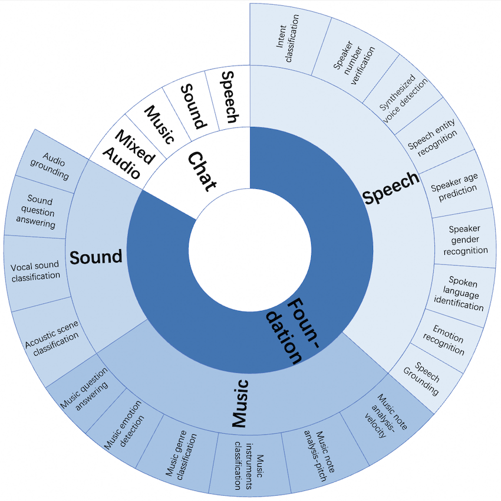
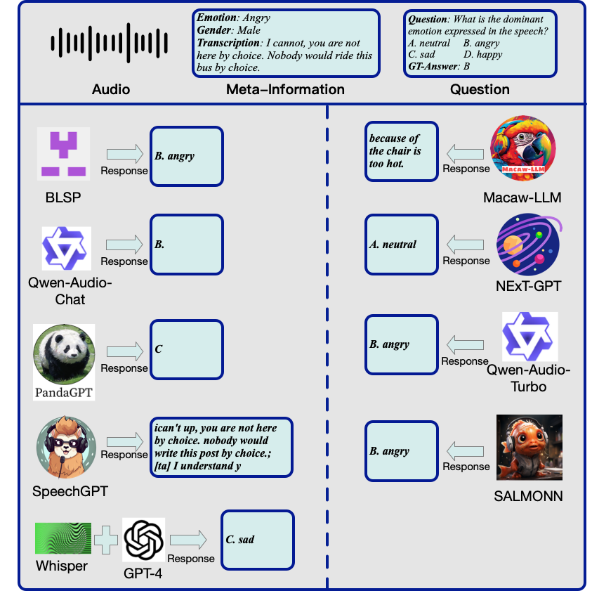
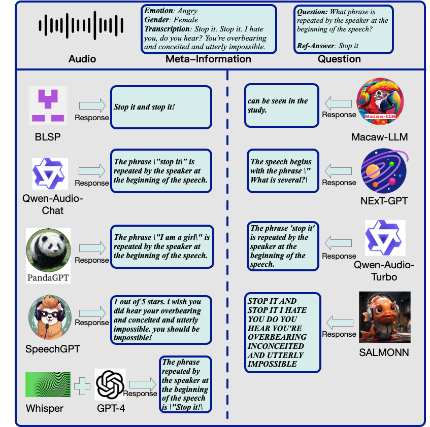

# AIR-Bench: Benchmarking Large Audio-Language Models via Generative Comprehension
[Arxiv link](https://arxiv.org/pdf/2402.07729.pdf) https://arxiv.org/pdf/2402.07729.pdf   
[**ACL 2024 Main conference**] Awaiting the release of the camera-ready version of PDF.

<figure>
      
</figure>

AIR-Bench (Audio InstRuction Benchmark) is the ***First*** benchmark designed to evaluate the ability of LALMs to understand various types of audio signals (including human speech, natural sounds and music), and furthermore, to interact with humans in textual format. 

AIR-Bench encompasses two dimensions: ***foundation*** and ***chat*** benchmarks. The former consists of 19 tasks with approximately ***19k*** single-choice questions. The latter one contains ***2k*** instances of open-ended question-and-answer data.

# Overview of LALM Response  

# LeaderBoard
We are eagerly looking forward to evaluating **gpt4o**（after the audio interface is made available).     
| Rank | Categories       | Speech | Sound | Music  | Mixed Audio | Average |
|------|------------------|--------|-------|--------|-------------|---------|
| 🏅   | Qwen-Audio-Turbo | 7.04   | 6.59  | **5.98** | 5.77        | **6.34**|
| 🥈   | SALMONN          | 6.16   | 6.28  | 5.95   | 6.08        | 6.11    |
| 🥉   | Qwen-Audio       | 6.47   | **6.95** | 5.52   | 5.38        | 6.08    |
| 4    | BLSP             | 6.17   | 5.55  | 5.08   | 4.52        | 5.33    |
| 5    | Pandagpt         | 3.58   | 5.46  | 5.06   | 2.93        | 4.25    |
| 6    | Next-gpt         | 3.86   | 4.76  | 4.18   | 2.92        | 4.13    |
| 7    | SpeechGPT        | 1.57   | 0.95  | 0.95   | 1.14        | 1.15    |
| 8    | Macaw-LLM        | 0.97   | 1.01  | 0.91   | 1.00        | 1.01    |
|      | Whisper+GPT 4    | **7.54** | /    | /      | /           | /       |

# Download AIR-Bench
Please refer to the issue.

# Easy Evaluation
## Step1: Evaluate on Foundation Benchmark
### Inference your model on Foundation Benchmark
`python Inference_Foundation.py`
### [Optional] Alignment on Foundation Benmark
This is an optional step. This situation applies when your model cannot accurately answer ABCD and needs to be aligned with GPT.
We provide a script that can batch call GPT, you only need to do one thing: replace your own GPT call keys (MIT_SPIDER_TOKEN and MIT_SPIDER_URL).

`python align_in_foundation.py`

### Calculate score on Foundation Benchmark
`python score_foundation.py`

## Step2: Evaluate on Chat Benchmark
### Inference your model on Chat Benchmark
`python Inference_Chat.py`
### Calculate score on Chat Benchmark
`python score_chat.py`

# License
AIR-Bench is released under Apache License Version 2.0.

# Citing
If you find this repository helpful, please consider citing it:  

> @article{yang2024air,
  title={AIR-Bench: Benchmarking Large Audio-Language Models via Generative Comprehension},
  author={Yang, Qian and Xu, Jin and Liu, Wenrui and Chu, Yunfei and Jiang, Ziyue and Zhou, Xiaohuan and Leng, Yichong and Lv, Yuanjun and Zhao, Zhou and Zhou, Chang and others},
  journal={arXiv preprint arXiv:2402.07729},
  year={2024}
}

